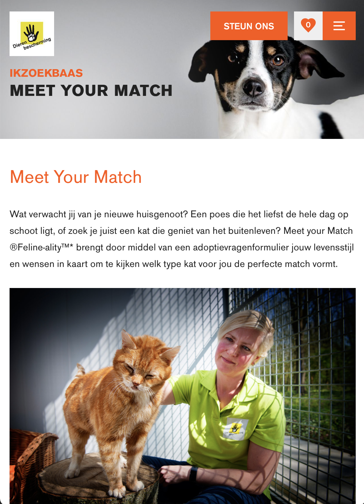

# Procesverslag
Markdown is een simpele manier om HTML te schrijven.  
Markdown cheat cheet: [Hulp bij het schrijven van Markdown](https://github.com/adam-p/markdown-here/wiki/Markdown-Cheatsheet).

Nb. De standaardstructuur en de spartaanse opmaak van de README.md zijn helemaal prima. Het gaat om de inhoud van je procesverslag. Besteedt de tijd voor pracht en praal aan je website.

Nb. Door *open* toe te voegen aan een *details* element kun je deze standaard open zetten. Fijn om dat steeds voor de relevante stuk(ken) te doen.

## Jij

uitwerken voor kick-off werkgroep

### Auteur:
Dana Tehubijuluw

#### Je startniveau:
Ik denk te starten met rood

#### Je focus:
extra aandacht voor de surface laag (nog niet zeker, wat betekend dit ookalweer?)
 

## Je website

uitwerken voor kick-off werkgroep

### Je opdracht:
https://ikzoekbaas.dierenbescherming.nl

Ik ben gek op dieren. Ik vind het dan ook belangrijk dat alle dieren die in het dierenasiel zitten, een plekje krijgen bij een warm thuis. Het lijkt mij leuk om deze website aan te pakken.

#### Screenshot(s) van de eerste pagina (small screen): 
hier de naam van de pagina  

#### Screenshot(s) van de tweede pagina (small screen):
hier de naam van de pagina  

 

## Breakdownschets (week 1)

uitwerken na afloop 2e werkgroep

### de hele pagina: 

<!--> ### dynamisch deel (bijv menu): 

### wellicht nog een dynamisch deel (bijv filter): 
 <!--> 

## Voortgang 1 (week 2)

uitwerken voor 1e voortgang

### Stand van zaken
De oefening van deze week ging eigenlijk best goed. Ik herinnerde mij weer een aantal dingen van vorig jaar, dus dat was handig. Wel blijf ik dingen ontdekken die
toch anders moeten dan ik gewend ben of gedacht had. Wel heb ik er veel van geleerd.

### Agenda voor meeting
samen met je groepje opstellen

| marijn          | tessa              | dana                | sadie            |
| ---             | ---                | ---                 | ---              |
| HTML video      |                    |                     |                  |
| achtergrond img | nog geen vragen    | img als achtergrond | nog geen vragen  |
| ...             | ...                | ...                 | ...              |

### Verslag van meeting
hier na afloop snel de uitkomsten van de meeting vastleggen

- sanne heeft uitgelegd hoe je een carroussel/slideshow kunt maken, dit wilde ik graag weten
- ook door de vragen van andere studenten te beantwoorden leer ik weer nieuwe dingen die ik zelf kan toepassen in mijn website

## Voortgang 2 (week 3)

uitwerken voor 2e voortgang

### Stand van zaken
deze week ben ik bezig geweest met mijn website. ik vond het heel fijn dat we in de les van woensdag tijd kregen om aan onze website te werken. je kunt namelijk samen met andere studenten overleggen en makkelijk met elkaar meekijken en helpen. op deze manier worden je problemen veel sneller opgelost en kun je ook nog is anderen helpen met jouw kennis. als ik er echt niet uit kwam kon ik ook makkelijk iets aan de docent vragen. 

ik loop elke keer tegen verschillende dingen aan, sommige zijn zo weer opgelost en sommige nemen wat meer tijd in. ik ben wel blij dat we morgen weer een aantal dingen kunnen vragen!

### Agenda voor meeting
samen met je groepje opstellen

| Dana                         | Marijn M                      | Sadie        | Tessa            |
| ---                          | ---                           | ---          | ---              |
| hoe maak je een uitklap menu | vlak in de tekst even breedt  | niks         | niks             |
| en mijn slideshow doet raar  | als de afbeelding             | 
|                              | (sneaker story page)          | 

### Verslag van meeting
hier na afloop snel de uitkomsten van de meeting vastleggen

- De studentassistenten hebben linkjes gedeeld waar ik kan zien hoe een uitklap menu werkt
- Deanna heeft meegekeken met mijn slideshow en deze is weer gerepareerd
- De studentassistenten hebben de rest van mijn groepje ook met hun probleempjes geholpen --> iedereen kon weer verder!

## Toegankelijkheidstest (week 4)

uitwerken na test in 8e voortgang

### Bevindingen
Lijst met je bevindingen die in de test naar voren kwamen:

#### Titel eerste bevinding
Hier korte omschrijving (met indien nodig een afbeelding)

Hier een omschrijving van hoe het opgelost kan worden (met indien nodig een afbeelding)

#### Titel tweede bevinding. 
Hier korte omschrijving (met indien nodig een afbeelding)

Hier een omschrijving van hoe het opgelost kan worden (met indien nodig een afbeelding)

#### Titel volgende bevinding. 
Hier korte omschrijving (met indien nodig een afbeelding)

Hier een omschrijving van hoe het opgelost kan worden (met indien nodig een afbeelding)

#### Titel nog een bevinding. 
Hier korte omschrijving (met indien nodig een afbeelding)

Hier een omschrijving van hoe het opgelost kan worden (met indien nodig een afbeelding)

## Voortgang 3 (week 4)

uitwerken voor 3e voortgang

### Stand van zaken
Deze week was ik helaas ziek en heb ik een aantal dingen gemist. Omdat de webite volgende week af moet, heb ik dit als hoogste prioriteit gekozen en ben ik hier verder mee aan de slag gegaan. Het loopt nog wat stroef en ik loop nog tegen een aantal dingen aan, maar het moet vast goed komen.

### Agenda voor meeting
samen met je groepje opstellen

| Dana                  | student 2          | student 3    | student 4        |
| ---                   | ---                | ---          | ---              |
| ik zit nog steeds     | en dit             | en ik dit    | en dan ik dat    |
| vast met een uitklap  | dit als er tijd is | nog een punt | dit wil ik zeker |
| venster               | ...                | ...          | ...              |

### Verslag van meeting
hier na afloop snel de uitkomsten van de meeting vastleggen

- Sanne heeft mij geholpen met een uitklap venster in mijn formulier, uiteindelijk was dit gelukkig helemaal niet zo ingewikkeld!
- Na de meeting met het groepje heb ik samen met Sanne nog even mijn website doorgelopen, we hebben gekeken naar welke elementen erin moeten en welke weggelaten mogen worden. Dit heeft mij erg geholpen!

## Eindgesprek (week 5)

uitwerken voor eindgesprek

### Stand van zaken
Ik had moeite met een aantal dingen. 
1. ik moest 4 images naast elkaar en onder elkaar plaatsen die als link dienen. dit lukte mij eerst niet, ookal leek dit simpel. 
 Hoe het moet
 Hoe het er bij mij uitzag (alle beelden over elkaar)

2. de slideshow werd op de tweede pagina ook meegenomen bij andere images, maar dit was niet de bedoeling.

### Screenshot(s)

hier screenshot(s) van je eindresultaat

## Bronnenlijst

continu bijhouden terwijl je werkt

Nb. Wees specifiek ('css-tricks' als bron is bijv. niet specifiek genoeg).

1. bron 1
2. bron 2
3. ...

